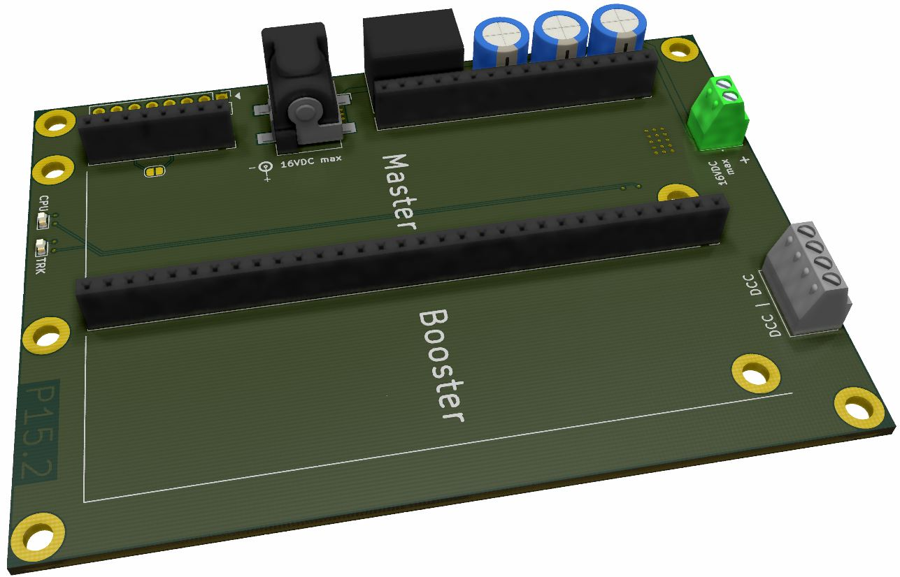
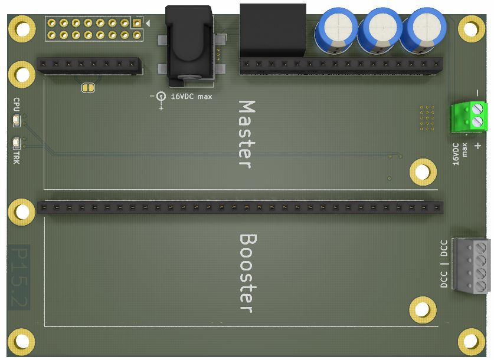
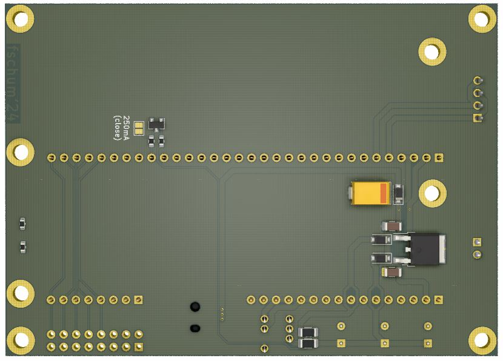

# RTB_P15

My homebrew P15 power board provides unmonitored power and is a stripped down version of the C11 power board. The main purpose of this card is to operate as a decoder tester/programmer via a USB connection to the PC. No external power supply is required as it can be powered via the USB and the optional isolated DC/DC converter.

See also

- [RTB_C10 - Master](https://github.com/git4dcc/RTB_C10)
- [RTB_C11 - Power](https://github.com/git4dcc/RTB_C11)
- [RTB_C12 - Booster](https://github.com/git4dcc/RTB_C12)

User Guides

- User Guide - DE
- [User Guide - EN](https://rtb4dcc.de/rtb_user_guide_en/)

## Power Board features
- **passive**
  - no CPU on this board
- **DC/DC**
  - isolated DC/DC step up converter (5V->12V, 250mA)
  - (optional) external power connect (12V-16V, >1A)
- **Slots**
  - 1x Master slot
  - 1x Booster slot
  - 1x FDX extender (for development only)
- **Connectors**
  - terminal connector or (2.1mm / 2.5mm) barrel jack for external power
  - DCC connector

# Hardware
The PCB layout uses SMD footprints down to 0603 parts. Handsoldering is possible.
Further, the PCB has been optimized for automated assembly (BOM and Position files as CSV).

## PCB
- 2-layer PCB, FR4, 1.6mm
- CPU: none

# YouTube
See the (P15, C10, C12) used in the Decoder Tester use case.  

This project is intended for hobby use only and is distributed in accordance with the Apache License 2.0 agreement.
